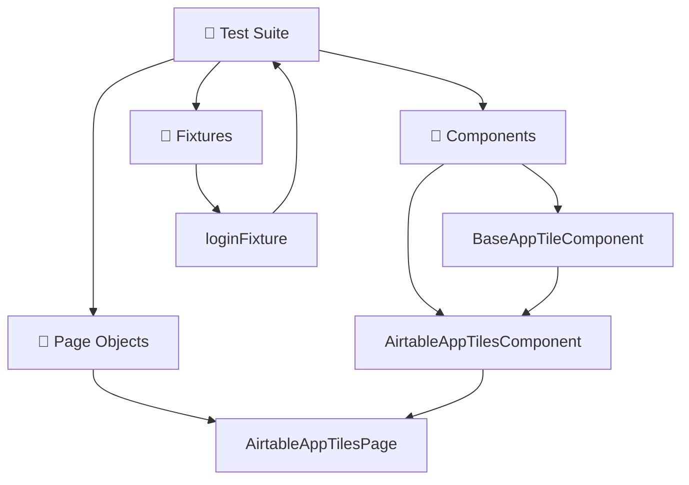

<div align="center">

# 🔗 Integrations Testing Module

**Automated UI testing for third-party application integrations**

[](https://playwright.dev/)
[](https://www.typescriptlang.org/)
[](#test-tags)

</div>

---

## 📋 Table of Contents

- [✨ Overview](#-overview)
- [🚀 Quick Start](#-quick-start)
- [🧩 Supported Integrations](#-supported-integrations)
- [🏗️ Architecture](#️-architecture)
- [🧪 Test Structure](#-test-structure)
- [📊 Test Data](#-test-data)
- [⚡ Commands](#-commands)
- [🔧 Configuration](#-configuration)
- [📁 Folder Structure](#-folder-structure)
- [🎯 Best Practices](#-best-practices)

---

## ✨ Overview

This module provides comprehensive UI automation testing for **third-party app integrations**, ensuring seamless functionality of external applications within the platform.

### 🎯 What We Test

| Feature                      | Description                                       |
| ---------------------------- | ------------------------------------------------- |
| 🔧 **Tile Management**       | Add, configure, edit, and remove app tiles        |
| 🎨 **Personalization**       | Customize sorting, filtering, and display options |
| 👥 **Multi-User Flows**      | Admin creation, end-user verification workflows   |
| 📱 **Dashboard Integration** | Tile placement and dashboard interactions         |
| ✅ **Validation**            | Toast messages, tile presence, and functionality  |

---

## 🚀 Quick Start

### 1️⃣ Run All Tests

```bash
npm run test:integrations
```

### 2️⃣ Run Specific Integration

```bash
npx playwright test src/modules/integrations/tests/airtableAppTiles.spec.ts
```

### 3️⃣ Run with Browser UI

```bash
npx playwright test --headed src/modules/integrations/tests/airtableAppTiles.spec.ts
```

---

## 🧩 Supported Integrations

<table>
<tr>
<td align="center">

<br>
<strong>Content Calendar & Database Management</strong>
<br>
📅 Task management • 🗂️ Data organization • 📊 Reporting tiles
</td>
</tr>
</table>

---

## 🏗️ Architecture



### 🔧 Core Components

| Component                   | Purpose                                     |
| --------------------------- | ------------------------------------------- |
| `BaseAppTileComponent`      | 🏗️ Common functionality for all app tiles   |
| `AirtableAppTilesComponent` | 🎯 Airtable-specific functionality          |
| `AirtableAppTilesPage`      | 📄 Complete workflows and page interactions |
| `loginFixture`              | 🔐 Enhanced authentication with retry logic |

---

## 🧪 Test Structure

### 🏷️ Test Tags

| Tag                    | Priority         | Description                   |
| ---------------------- | ---------------- | ----------------------------- |
| `TestPriority.P0`      | 🔴 **Critical**  | Core functionality, must pass |
| `TestGroupType.SMOKE`  | 🟡 **Essential** | Basic feature validation      |
| `TestGroupType.SANITY` | 🟢 **Extended**  | Comprehensive coverage        |

### 📝 Test Cases

```typescript
test(
  'Add Airtable tile with basic configuration',
  {
    tag: [TestPriority.P0, TestGroupType.SMOKE],
  },
  async () => {
    tagTest(test.info(), {
      zephyrTestId: 'SEN-12345',
      storyId: 'SEN-67890',
    });
    // Test implementation...
  }
);
```

---

## 📊 Test Data

### 🗂️ Airtable Configuration

```typescript
export const AIRTABLE_TILE_DATA = {
  TILE_TITLE: 'Display content calendar tasks',
  UPDATED_TILE_TITLE: 'Display content calendar tasks Updated',
  BASE_NAME: 'Content Calendar',
  TABLE_ID: 'tbl5wWrenoiBW5ZiI',
  PERSONALIZE_SORT_BY: 'Task name',
  PERSONALIZE_SORT_ORDER: 'Ascending',
};
```

### 💡 Usage Example

```typescript
const airtablePage = new AirtableAppTilesPage(page);

// ✅ Add tile with configuration
await airtablePage.addAirtableTile(
  AIRTABLE_TILE_DATA.TILE_TITLE,
  {
    baseName: AIRTABLE_TILE_DATA.BASE_NAME,
    tableId: AIRTABLE_TILE_DATA.TABLE_ID,
  },
  UI_ACTIONS.ADD_TO_HOME
);

// 🎨 Personalize tile sorting
await airtablePage.personalizeTileSorting(
  AIRTABLE_TILE_DATA.TILE_TITLE,
  AIRTABLE_TILE_DATA.PERSONALIZE_SORT_BY,
  AIRTABLE_TILE_DATA.PERSONALIZE_SORT_ORDER
);
```

---

## ⚡ Commands

### 🧪 Testing Commands

<details>
<summary><strong>📋 Basic Test Execution</strong></summary>

```bash
# Run all integrations tests
npm run test:integrations

# Run specific test file
npx playwright test src/modules/integrations/tests/airtableAppTiles.spec.ts

# Run single test by name
npx playwright test -g "Add Airtable tile with basic configuration"

# Run tests by priority
npx playwright test --grep "@P0"
npx playwright test --grep "TestPriority.P0"
```

</details>

<details>
<summary><strong>🌐 Browser-Specific Testing</strong></summary>

```bash
# Run in specific browser
npx playwright test --project=chromium
npx playwright test --project=firefox
npx playwright test --project=webkit

# Run with browser UI
npx playwright test --headed

# Debug mode
npx playwright test --debug
```

</details>

<details>
<summary><strong>📊 Reporting & Debugging</strong></summary>

```bash
# Generate HTML report
npx playwright test --reporter=html

# Live test results
npx playwright test --reporter=line

# Detailed output
npx playwright test --reporter=verbose

# View trace after failure
npx playwright show-trace trace.zip

# Show last test results
npx playwright show-report
```

</details>

### 🔧 Development Commands

<details>
<summary><strong>🛠️ Code Quality & Setup</strong></summary>

```bash
# TypeScript compilation check
npx tsc --noEmit

# ESLint check & fix
npx eslint src/modules/integrations/
npx eslint src/modules/integrations/ --fix

# Install/Update Playwright
npx playwright install
npm install -D @playwright/test@latest
```

</details>

---

## 🔧 Configuration

### 🌍 Environment Setup

Create environment files in `env/` folder:

```bash
# qa.env
FRONTEND_BASE_URL=https://newintegrations.qa.simpplr.xyz
API_BASE_URL=https://newintegrations-api.qa.simpplr.xyz
APP_MANAGER_USERNAME=admin@company.com
APP_MANAGER_PASSWORD=SecurePassword123
```

### 🔐 Enhanced Login Configuration

```typescript
// Login with retry logic and optimizations
await loginToQAEnv(page, 'Admin', {
  maxRetries: 3, // 🔄 Retry up to 3 times
  timeout: 45000, // ⏱️ 45 second timeout
  skipIfLoggedIn: true, // ⚡ Skip if already authenticated
});
```

---

## 📁 Folder Structure

```
src/modules/integrations/
├── components/
│   ├── baseAppTileComponent.ts          # Base component
│   └── airtableAppTilesComponent.ts     # Airtable component
├── constants/
│   ├── testTags.ts                      # Test tags
│   ├── messageRepo.ts                   # Toast messages
│   └── common.ts                        # Common constants
├── fixtures/
│   └── loginFixture.ts                  # Login utilities
├── pages/
│   └── airtableAppTilesPage.ts          # Page object
├── test-data/
│   ├── app-tiles.test-data.ts           # Test data
│   └── static-files/                    # Test assets
├── tests/
│   └── airtableAppTiles.spec.ts         # Test suite
├── env/                                 # Environment configs
└── README.md                            # Documentation
```

## Best Practices

### Component Design

- Extend `BaseAppTileComponent` for common functionality
- Implement `configureAppTile()` for app-specific setup
- Use TypeScript interfaces for type safety
- Create reusable workflow methods

### Test Design

- Use page objects for complex workflows
- Include proper cleanup in `afterEach` hooks
- Use descriptive test names with appropriate tags
- Keep test data separate from test logic
- Implement retry logic for flaky operations

### Maintenance

- Keep dependencies and test data current
- Update documentation when adding features
- Ensure critical paths are tested
- Optimize test execution time

## Troubleshooting

### Common Issues

- **Login failures**: Check environment variables and credentials
- **Tile not found**: Verify tile was created successfully before operations
- **Timeout errors**: Increase timeout values in configuration
- **Flaky tests**: Add retry logic and better waiting strategies

### Debug Tips

- Use `--headed` mode to see browser interactions
- Add `console.log()` statements for debugging
- Use `--debug` mode for step-by-step execution
- Check test reports for detailed failure information

---

**Ready to test integrations!** For questions or issues, contact the QA team.
