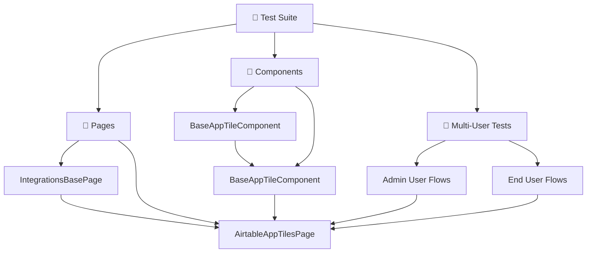

<div align="center">

# 🔗 Integrations Testing Module

**Automated UI testing for third-party application integrations**

[](https://playwright.dev/)
[](https://www.typescriptlang.org/)
[](#test-tags)
[](#multi-user-testing)

</div>

---

## 📋 Table of Contents

- [✨ Overview](#-overview)
- [🚀 Quick Start](#-quick-start)
- [🧩 Supported Integrations](#-supported-integrations)
- [🏗️ Architecture](#️-architecture)
- [🧪 Test Structure](#-test-structure)
- [👥 Multi-User Testing](#multi-user-testing)
- [📊 Test Data](#-test-data)
- [⚡ Commands](#-commands)
- [🔧 Configuration](#-configuration)
- [📁 Folder Structure](#-folder-structure)
- [🎯 Best Practices](#-best-practices)
- [🔍 Troubleshooting](#troubleshooting)

---

## ✨ Overview

This module provides comprehensive UI automation testing for **third-party app integrations**, ensuring seamless functionality of external applications within the platform. Our testing covers both single-user workflows and complex multi-user scenarios.

### 🎯 What We Test

| Feature                      | Description                                       | Test Coverage |
| ---------------------------- | ------------------------------------------------- | ------------- |
| 🔧 **Tile Management**       | Add, configure, edit, and remove app tiles        | ✅ Complete   |
| 🎨 **Personalization**       | Customize sorting, filtering, and display options | ✅ Complete   |
| 👥 **Multi-User Flows**      | Admin creation, end-user verification workflows   | ✅ Complete   |
| 📱 **Dashboard Integration** | Tile placement and dashboard interactions         | ✅ Complete   |
| ✅ **Validation**            | Toast messages, tile presence, and functionality  | ✅ Complete   |
| 🧹 **Cleanup & Recovery**    | Proper test isolation and resource cleanup        | ✅ Complete   |

---

## 🚀 Quick Start

### 1️⃣ Run All Tests

```bash
npm run test:integrations
```

### 2️⃣ Run Specific Integration

```bash
# Airtable App Tiles
npx playwright test src/modules/integrations/tests/ui-tests/absolute/AirtableAppTiles/airtableAppTiles.spec.ts

# Multi-User Tests
npx playwright test src/modules/integrations/tests/ui-tests/appTiles/Multi_User/AppTiles.multiuser.spec.ts
```

### 3️⃣ Run with Browser UI

```bash
npx playwright test --headed src/modules/integrations/tests/ui-tests/absolute/AirtableAppTiles/airtableAppTiles.spec.ts
```

---

## 🧩 Supported Integrations

<table>
<tr>
<td align="center">

<br>
<strong>Content Calendar & Database Management</strong>
<br>
📅 Task management • 🗂️ Data organization • 📊 Reporting tiles
<br>
<em>Includes single-user and multi-user testing scenarios</em>
</td>
</tr>
</table>

---

## 🏗️ Architecture



### 🔧 Core Components

| Component              | Purpose                                            | Usage                |
| ---------------------- | -------------------------------------------------- | -------------------- |
| `BaseAppTileComponent` | 🏗️ Common functionality for all app tiles          | Extend for new tiles |
| `BaseAppTileComponent` | 🎯 All app tile functionality (including Airtable) | All tile operations  |
| `IntegrationsBasePage` | 🧭 Base page plumbing for integrations             | Common page methods  |
| `AirtableAppTilesPage` | 📄 Complete workflows and page interactions        | End-to-end testing   |

---

## 🧪 Test Structure

### 🏷️ Test Tags

| Tag                    | Priority         | Description                   | Usage                 |
| ---------------------- | ---------------- | ----------------------------- | --------------------- |
| `TestPriority.P0`      | 🔴 **Critical**  | Core functionality, must pass | Production validation |
| `TestGroupType.SMOKE`  | 🟡 **Essential** | Basic feature validation      | Daily regression      |
| `TestGroupType.SANITY` | 🟢 **Extended**  | Comprehensive coverage        | Release validation    |

### 📝 Test Cases

```typescript
test(
  'Add Airtable tile with basic configuration',
  {
    tag: [TestPriority.P0, TestGroupType.SMOKE],
  },
  async () => {
    tagTest(test.info(), {
      zephyrTestId: 'SEN-12345',
      storyId: 'SEN-67890',
    });
    // Test implementation...
  }
);
```

---

## 👥 Multi-User Testing

### 🔐 User Roles & Workflows

| Role           | Responsibilities                 | Test Scenarios                 |
| -------------- | -------------------------------- | ------------------------------ |
| **Admin User** | Create tiles, manage sites       | Tile creation, configuration   |
| **End User**   | View tiles, personalize settings | Tile visibility, customization |

### 🧪 Multi-User Test Structure

```typescript
test.describe('Multi User Tests', () => {
  test.describe('Airtable App Tiles Integration', () => {
    let createdSiteIds: string[] = [];
    let createdTileNames: string[] = [];

    test.afterEach(async ({ page }) => {
      // Cleanup created resources
      for (const tileName of createdTileNames) {
        const cleanupPage = new AirtableAppTilesPage(page);
        await cleanupPage.removeTileThroughApi(tileName);
        await waitUntilTileAbsentInApi(page, tileName);
        await cleanupPage.reloadAndVerifyTileAbsent(tileName);
      }

      for (const siteId of createdSiteIds) {
        await deactivateSiteSafe(page, siteId);
      }

      // Reset for next test
      createdTileNames = [];
      createdSiteIds = [];
    });
  });
});
```

### 🔄 Test Flow

1. **Admin Setup**: Create site and configure tiles
2. **End User Verification**: Switch to end user and validate functionality
3. **Cleanup**: Remove all created resources
4. **Isolation**: Ensure tests don't interfere with each other

---

## 📊 Test Data

### 🗂️ Airtable Configuration

```typescript
export const AIRTABLE_TILE_DATA = {
  TILE_TITLE: 'Display content calendar tasks',
  UPDATED_TILE_TITLE: 'Display content calendar tasks Updated',
  BASE_NAME: 'Content Calendar',
  TABLE_ID: 'tbl5wWrenoiBW5ZiI',
  PERSONALIZE_SORT_BY: 'Task name',
  PERSONALIZE_SORT_ORDER: 'Ascending',
};
```

### 💡 Usage Example

```typescript
const airtablePage = new AirtableAppTilesPage(page);

// ✅ Add tile with configuration
await airtablePage.addAirtableTile(
  AIRTABLE_TILE_DATA.TILE_TITLE,
  {
    baseName: AIRTABLE_TILE_DATA.BASE_NAME,
    tableId: AIRTABLE_TILE_DATA.TABLE_ID,
  },
  UI_ACTIONS.ADD_TO_HOME
);

// 🎨 Personalize tile sorting
await airtablePage.personalizeTileSorting(
  AIRTABLE_TILE_DATA.TILE_TITLE,
  AIRTABLE_TILE_DATA.PERSONALIZE_SORT_BY,
  AIRTABLE_TILE_DATA.PERSONALIZE_SORT_ORDER
);
```

---

## ⚡ Commands

### 🧪 Testing Commands

<details>
<summary><strong>📋 Basic Test Execution</strong></summary>

```bash
# Run all integrations tests
npm run test:integrations

# Run specific test file
npx playwright test src/modules/integrations/tests/ui-tests/absolute/AirtableAppTiles/airtableAppTiles.spec.ts

# Run single test by name
npx playwright test -g "Add Airtable tile with basic configuration"

# Run tests by priority
npx playwright test --grep "@P0"
npx playwright test --grep "TestPriority.P0"

# Run multi-user tests specifically
npx playwright test src/modules/integrations/tests/ui-tests/appTiles/Multi_User/
```

</details>

<details>
<summary><strong>🌐 Browser-Specific Testing</strong></summary>

```bash
# Run in specific browser
npx playwright test --project=chromium
npx playwright test --project=firefox
npx playwright test --project=webkit

# Run with browser UI
npx playwright test --headed

# Debug mode
npx playwright test --debug
```

</details>

<details>
<summary><strong>📊 Reporting & Debugging</strong></summary>

```bash
# Generate HTML report
npx playwright test --reporter=html

# Live test results
npx playwright test --reporter=line

# Detailed output
npx playwright test --reporter=verbose

# View trace after failure
npx playwright show-trace trace.zip

# Show last test results
npx playwright show-report
```

</details>

### 🔧 Development Commands

<details>
<summary><strong>🛠️ Code Quality & Setup</strong></summary>

```bash
# TypeScript compilation check
npx tsc --noEmit

# ESLint check & fix
npx eslint src/modules/integrations/
npx eslint src/modules/integrations/ --fix

# Install/Update Playwright
npx playwright install
npm install -D @playwright/test@latest
```

</details>

---

## 🔧 Configuration

### 🌍 Environment Setup

Create environment files in `env/` folder:

```bash
# qa.env
FRONTEND_BASE_URL=https://newintegrations.qa.simpplr.xyz
API_BASE_URL=https://newintegrations-api.qa.simpplr.xyz
APP_MANAGER_USERNAME=admin@company.com
APP_MANAGER_PASSWORD=SecurePassword123
```

### 🔐 Enhanced Login Configuration

```typescript
// Login with retry logic and optimizations
await loginToQAEnv(page, 'Admin', {
  maxRetries: 3, // 🔄 Retry up to 3 times
  timeout: 45000, // ⏱️ 45 second timeout
  skipIfLoggedIn: true, // ⚡ Skip if already authenticated
});
```

---

## 📁 Folder Structure

```
src/modules/integrations/
├── components/
│   ├── baseAppTileComponent.ts          # Base component
│   └── (airtableAppTilesComponent.ts removed - functionality moved to baseAppTileComponent.ts)
├── constants/
│   ├── testTags.ts                      # Test tags
│   ├── messageRepo.ts                   # Toast messages
│   └── common.ts                        # Common constants
├── fixtures/
│   └── loginFixture.ts                  # Login utilities
├── pages/
│   └── airtableAppTilesPage.ts          # Page object
├── test-data/
│   ├── app-tiles.test-data.ts           # Test data
│   └── static-files/                    # Test assets
├── tests/
│   ├── ui-tests/
│   │   ├── absolute/
│   │   │   └── AirtableAppTiles/        # Single-user tests
│   │   └── appTiles/
│   │       └── Multi_User/              # Multi-user tests
│   └── airtableAppTiles.spec.ts         # Legacy test suite
├── env/                                 # Environment configs
└── README.md                            # Documentation
```

---

## 🎯 Best Practices

### 🏗️ Component Design

- ✅ Extend `BaseAppTileComponent` for common functionality
- ✅ Implement `configureAppTile()` for app-specific setup
- ✅ Use TypeScript interfaces for type safety
- ✅ Create reusable workflow methods

### 🧪 Test Design

- ✅ Use page objects for complex workflows
- ✅ Include proper cleanup in `afterEach` hooks
- ✅ Use descriptive test names with appropriate tags
- ✅ Keep test data separate from test logic
- ✅ Implement retry logic for flaky operations
- ✅ Ensure proper test isolation between runs

### 🧹 Maintenance & Cleanup

- ✅ Keep dependencies and test data current
- ✅ Update documentation when adding features
- ✅ Ensure critical paths are tested
- ✅ Optimize test execution time
- ✅ Implement comprehensive cleanup strategies
- ✅ Use arrays to track created resources

---

## 🔍 Troubleshooting

### 🚨 Common Issues

| Issue                | Cause                        | Solution                    |
| -------------------- | ---------------------------- | --------------------------- |
| **Login failures**   | Invalid credentials/env vars | Check environment variables |
| **Tile not found**   | Tile creation failed         | Verify tile was created     |
| **Timeout errors**   | Slow operations              | Increase timeout values     |
| **Flaky tests**      | Race conditions              | Add retry logic             |
| **Cleanup failures** | Resource already removed     | Add existence checks        |

### 🛠️ Debug Tips

- 🔍 Use `--headed` mode to see browser interactions
- 📝 Add `console.log()` statements for debugging
- 🐛 Use `--debug` mode for step-by-step execution
- 📊 Check test reports for detailed failure information
- 🔄 Verify cleanup operations complete successfully

### 🧹 Cleanup Best Practices

```typescript
// ✅ Good: Track resources and clean up
let createdTileNames: string[] = [];
let createdSiteIds: string[] = [];

// Add to arrays when creating
createdTileNames.push(tileName);
createdSiteIds.push(siteId);

// Clean up in afterEach
test.afterEach(async ({ page }) => {
  for (const tileName of createdTileNames) {
    await cleanupPage.removeTileThroughApi(tileName);
  }
  // Reset arrays
  createdTileNames = [];
  createdSiteIds = [];
});
```

---

## 📈 Performance & Optimization

### ⚡ Test Execution Tips

- **Parallel Execution**: Run tests in parallel when possible
- **Resource Reuse**: Share page instances when appropriate
- **Smart Waiting**: Use proper wait strategies instead of fixed delays
- **Cleanup Optimization**: Batch cleanup operations when possible

### 🔄 Retry Strategies

```typescript
// Implement retry logic for flaky operations
const retryOperation = async (operation: () => Promise<void>, maxRetries = 3) => {
  for (let i = 0; i < maxRetries; i++) {
    try {
      await operation();
      return;
    } catch (error) {
      if (i === maxRetries - 1) throw error;
      await page.waitForTimeout(1000 * (i + 1)); // Exponential backoff
    }
  }
};
```

---

**🚀 Ready to test integrations!**

For questions, issues, or contributions, contact the QA team or create an issue in the repository.

---

<div align="center">

_Last updated: December 2024_  
_Built with ❤️ by the QA Automation Team_

</div>
